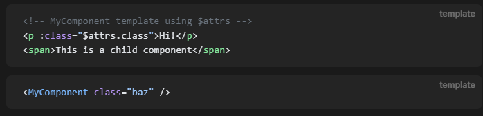

### Тестовый, неадаптивный Vue проект.

Здесь только: defineProps, defineEmits(типизация $emit, @), ref, routerLink, defineAsyncComponent, v-for, v-if, v-show, , computed, v-bind(:), reactive, , watchEffect.

#### Временные наблюдения, не все верные, скорее всего:

- Если в компоненте метод будет использоваться в скрипте - `defineProps`, а если планируется использовать метод при каком-то опредеделенном событии (click, change, др.) - `defineEmits`
- `v-if` приоритет больше, чем у `v-for`, если они на одном уровне
- пустая оболочка - `template`
- передать объект пропсом, не разворачивая его на каждое отдельно свойство вручную -** v-bind="something"**
- у **`reactive`** нет value
- для динамического импорта компонентов, помимо import(), - **`defineAsyncComponent`**
- ` v-show` работает только с display: none
- если при изменениии каких-то зависимостей нужно менять значение стейта(ref), то это стоит делать внутри **`watchEffect`**, а не нагромождать конструции computed
- **`watcheffect`** работает при монтировании
- типизация** `defineProps`, `defineEmits`** и др. с typescript происходит через женерик
- Удобный тип для **`defineEmits`**, он хотя бы показывает названия всех эмитов, которые получает компонент, когда делаешь вызов через `$emit`

```ts
type Emits = {
  changeOption: [sort: TypeSortPlants];
};
```

- Результат defineEmits можно получить в переменную, но использовать конкретно эту переменную надо только в **скрипте**, а не в template. Для разметки отдельный вызов через **`$emit()`**
- При вызове `$emit()` не надо городить стрелочную функцию для получения ивента, для это есть **`$event`**

- Можно делать классы, которые работают в зависимости от каких-то условий, как, например, класс _active_ будет на элементе только тогда, когда _isActive_ станет равно _true_

```ts
<div
  class="static"
  :class="{ active: isActive, 'text-danger': hasError }"
></div>
```

```ts
// КЛАССЫ
const class2 = "class"
"class"
{class: isClass, class2: isClass2}
["class"]
[{class: isClass}, 'class2', class2]
```

- `$attrs.class` для того, чтобы повесить класс извне на определенный элемент, а не на родительский, на какой он повесится сам
  

- **Полезно**

```ts
<span v-for="n in 10">{{ n }}</span>
```

- в обработчиках событий хэндл-метод можно вызывать прям инлайн без стрелочной функции, если надо передать значение

```ts
@click="something"
@click="something('TEXT')"
@click="() => something('TEXT')"

@click="something(@event)"
@click="(e) => something(e)"
```
- `v-model` вместо явного навешивания ref в :value и указания функции изменения при @change
```ts
// вместо этого
<input :value="text" @input="event => text = event.target.value">
// это
<input v-model="text">
```
- **ЖЦ** - `onMounted`, `onUpdated`, `onUnmounted`. onMounted(() => {})
- `watch` - для явного указания зависимостей. Зависимости можно получать просто указав их, через геттер. `watch` - может быть **асинхронным**
```ts
watch(dep, () => {})
watch(dep, (dep) => {})
watch(dep, (newValue, oldValue) => {})
// геттер 
watch(() => dep, (dep) => {})
// несколько зависимостей
watch([dep, dep2], async ([dep, dep2]) => {})
watch([dep, () => dep2.value], async ([dep, dep2]) => {})
// вычисление зависимостей
watch(() => dep.value + dep2.value, (sumDeps) => {})
// reactive только через геттер
// wont work! -> watch(reactive.prop, () => {})
watch(() => reactive.prop, (prop) => {})

// если в наблюдателе используется async действия, которые используют зависимости, то обязательно нужно использовать onWatcherCleanup() для сброса, если зависимость во время выполнения промиса изменится
import { watch, onWatcherCleanup } from 'vue'
watch(id, (newId) => {
  const controller = new AbortController()
  fetch(`/api/${newId}`, { signal: controller.signal }).then(() => {})
  onWatcherCleanup(() => {
    controller.abort()
  })
})

// или можно получить onCleanup callback
watch(id, (newId, oldId, onCleanup) => {
  onCleanup(() => {
  })
})
watchEffect((onCleanup) => {
  onCleanup(() => {
  })
})
```
- `onWatcherCleanup` - не используется после await, только для синхронных. `onCleanup` - подходит для асинхронных
- **ref** для элемента - `useTemplateRef('my-name')` ` <input ref="my-name" />`- до vue 3.5 использовался обычный **ref()**
- `<input :ref="(el) => { /* assign el to a property or ref */ }">` - :ref функция будет вызываться при каждом обновлении компонента
- defineExpose относится к рефам. Указывается в потомках для получения данных в родителе. Через childRef.value.something ?
- `:is` - Динамечское переключение блоков в компоненте в зависимости от чего-то без использования computed, watchEffect, ref, v-if. Компонент проходит весь ЖЦ при показе и скрытии. Вечно живым, даже при скрытии, можно сделать с помощью `<KeepAlive>`
```ts 
const currentTab = ref('')
const tabs = {
  Component1,
  Component2, ...
}
// <!-- Component changes when currentTab changes -->
<component :is="tabs[currentTab]"></component>
```
- `v-model`, `defineModel` - событие *update:modelValue*
```ts
// <!-- Child.vue -->
<script setup>
const model = defineModel()

function update() {
  model.value++
}
</script>

<template>
  <div>Parent bound v-model is: {{ model }}</div>
  <button @click="update">Increment</button>
  // или так
  <input v-model="model" />
</template>

// <!-- Parent.vue -->
<Child v-model="countModel" />

// несколько моделей
<MyComponent v-model:title="bookTitle" />

// <!-- MyComponent.vue -->
<script setup>
const title = defineModel('title')
</script>

<template>
  <input type="text" v-model="title" />
</template>

// модификаторы
<MyComponent v-model.capitalize="myText" />

// <!-- MyComponent.vue -->
<script setup>
const [model, modifiers] = defineModel({
  set(value) {
    if (modifiers.capitalize) {
      return value.charAt(0).toUpperCase() + value.slice(1)
    }
    return value
  }
})
</script>

<template>
  <input type="text" v-model="model" />
</template>
// несколь моделей с модификаторами
//first and last - ref()
<UserName
  v-model:first-name.capitalize="first"
  v-model:last-name.uppercase="last"
/>
```
- можно пробрасывать классы и обработчики событий в компонент - они неявно будут повешаны на root элементе. то есть принимать событие через defineEmits, если root элемент будет его использовать - нет надобности.
- чтобы отключить пробрасывание в комопнент, нужно использовать `defineOptions`
```ts
defineOptions({
  inheritAttrs: false
})

// при отключенном пробрасывании, все полученные атрибуты можно назначить определенному элементу
<button class="btn" v-bind="$attrs">Click Me</button>
```
- Объект `$attrs` включает в себя все атрибуты, которые не объявлены компонентами *props* или *emits*($attrs.onClick) опциями
 - `const attrs = useAttrs()` для получения атрибутов в скрипте. *Watchers* не работают для отслеживания атрибутов. Нужно использовать `onUpdated()`
 - `slot`
```ts
 // FALLBACK SLOTS
 <button type="submit">
  <slot>
    Submit <!-- fallback content -->
  </slot>
</button>

// NAMED SLOTS 
<slot name="header"></slot>
// передача именованного слота
<Something>
  // <template #header>
  <template v-slot:header>
    <!-- content for the header slot -->
  </template>
</Something>
```
 - `#` - сокращенный *v-slot*
 - ` $slots` - используется с условиями -  $slots.name
```ts
// <!-- <MyComponent> template -->
<div>
  <slot :text="greetingMessage" :count="1"></slot>
</div>
// call component
// <MyComponent v-slot="{text. count}">
<MyComponent v-slot="slotProps">
  {{ slotProps.text }} {{ slotProps.count }}
  // {{ text }} {{ count }}
  // greetingMessage 1
</MyComponent>
```
```ts
//  <!-- <MyComponent> template -->
<div>
  <slot :message="hello"></slot>
  <slot name="footer" />
</div>  
// call
<MyComponent>
  <!-- Use explicit default slot -->
  <template #default="{ message }">
    <p>{{ message }}</p>
  </template>

  <template #footer>
    <p>Here's some contact info</p>
  </template>
</MyComponent>
```

##### Vue-router

- При обозначении вложенных(динамических) маршрутов в роутере, поле **`name`** может быть только у **потомков**
- `<router-view /> - <slot />` для роутера (<RouterView /> - vue-router)
- в таком случае нет layout'a, то есть просто вставляется компонент

```ts
  {
    path: PATHS.PARENT,
    children: [
      {
        path: '',
        component: TestView
      },
      {
        path: PATHS.PARENT_NESTED,
        name: 'nested',
        component: VisitSection
      }
    ]
  }
```

- можно использовать **`name`** в ссылке маршрута, вместо указания явного path - :to="{name: 'nested'}"
- `useRouter`, **router.push({path: '', params: {}} ) не будет работать, path и params несовместимы**. Вместо этого нужно использовать `name` + `params`
- `<router-view name="helper" /> ` - можно задавать имя, чтобы отдельно в каждый блок router-view выводить определенный компонент, чтобы избежать использования лишнего template-компонента. **По умолчанию имя - `default`**.

```ts
{
  path: '/settings',
  component: UserSettings,
  children: [
    {
      path: 'emails',
      component: UserEmailsSubscriptions
    },
    {
      path: 'profile',
      components: {
        default: UserProfile,
        helper: UserProfilePreview
      }
    }
  ]
}
```

- Если используется `redirect`, то можно не заполнять поле component, поскольку оно достигнуто не будет **(существует еще alias)**

```ts
redirect: to => {
  // the function receives the target route as the argument
  // we return a redirect path/location here.
  return { path: '/something', query: { q: to.params.searchText } }
},
```

- `name` роута должно быть уникальным во всем роутере
- при создании **вложенных** маршрутов, нужно помнить, что / делает путь главным, например, пропуская динамический параметр.

```ts
/test/:id
  /nested -> /test/nested
  nested -> /test/id/nested
```

- **динамический** параметр можно получать пропсом в компоненте, - необходим `defineProps` описанный в компоненте (название пропса должно совпадать с именем динамического сегмента), и параметр `props: true` в роуте(для каждого router-view отдельно можно указать получение пропсов)

```ts
{
  path: '/user/:id',
  components: { default: User, sidebar: Sidebar },
  props: { default: true, sidebar: false }
}
```

- можно менять класс активных ссылок в роутере
- **404 страница**

```ts
{ path: '/:pathMatch(.*)', component: NotFoundComponent }
```
